# Ikram Besbassi
**Software Engineer**

 

I'm a Software Engineer with a Master's degree in Software Engineering. I build backend services and APIs, full-stack web applications, and data pipelines, and I integrate AI/NLP capabilities into the systems I build.

 

### Tech Stack

**Languages** 

**Backend & APIs** 

**Frontend** 

**Data & AI** 

**Databases & Messaging** 

**DevOps & Infrastructure** 

**Cloud** 

**Other** 

 

### Selected Public Work

**ATM Monitoring Platform** — Full-stack platform for monitoring and analyzing an ATM network.
`Next.js · TypeScript · FastAPI · PostgreSQL · Redis · Celery · Docker`
**[View repository →](https://github.com/Ikrambes/ATM-Monitoring-Platform)**

**SEO Insight** — Python application for automated SEO keyword analysis using NLP.
`Python · Flask · spaCy · TF-IDF`
**[View repository →](https://github.com/Ikrambes/SEO-Insight)**

 

### 🐍 Snake

> Take a quick break.

  

 

**Open to Software Engineering opportunities.**

<a href="https://www.linkedin.com/in/ikrambes/" target="_blank" rel="noopener noreferrer">LinkedIn</a> ·
<a href="mailto:besbassi.ikram@gmail.com">Email</a> ·
<a href="https://github.com/Ikrambes" target="_blank" rel="noopener noreferrer">GitHub</a>

